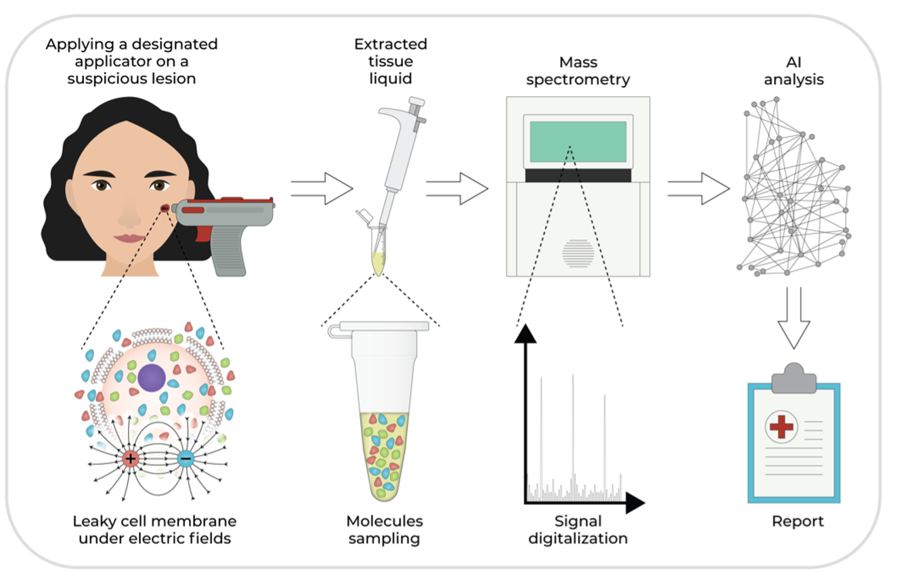
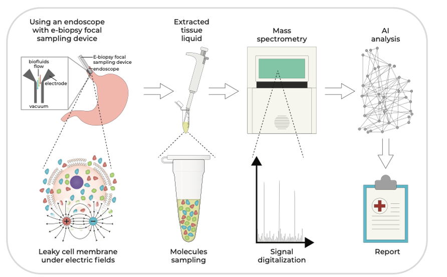

### Elsy Medical  

Elsy envisions a world where every patient will get molecular profiling of suspicious lesions on the spot

### Our product

Elsy Medical develops E-biopsy – a minimally invasive molecular sampling tool for solid tissue diagnostics!

### <a href="https://youtu.be/mmqsOUK2Qko" > What is E-biopsy??

A minimally invasive molecular sampling tool for solid tissues in vivo with electroporation for rapid diagnostics

E-biopsy - is a minimally invasive molecular sampling method that utilizes in-situ electroporation (i.e., pulsed electric fields) to disrupt cell membranes in a targeted area, resulting in the release of cellular components, such as proteins and lipids. Tissue extract is then collected using a syringe, and subsequently, the content is discharged to an external buffer and undergoes molecular analysis consisting of purification, separation, identification, and quantification of the molecular structure of the tissue extract removed. 

The electroporation system consists of a pulsed electric field generator, an applicator, and an analysis unit providing information on the extracted cellular contents.

The feasibility of the E-biopsy was already demonstrated by the project team in animal and in ex vivo human clinical studies. The technology is not limited to a specific tissue, and as such, may support a broad range of clinical applications, such as screening, aiding in diagnosis, detecting of recurrence of tumor post-intervention, assessing tumor heterogeneity, and more. Being an alternative to many other lesion-analysis approaches, it may also augment them leading to improved analysis quality.

Due to its minimally invasive nature, the E-biopsy enables the gathering of multiple samples from the same lesion, opening the possibility of creating its high-resolution spatial molecular profile,  and increasing the sensitivity and specificity of the analysis. Being both simple and molecular-based sampling technology, the E-biopsy approach reduces the load on many clinical resources, and especially on pathologists, thus improving the medical treatment efficiency and reducing the overall costs. 

### Current Applications:

### Dermatology
 

### Gastroenterology: Barrett’s esophagus. Pancreatic masses.
 

### Milestones already accomplished
* Fully functional, battery-powered prototype device Q3-2022
* Handheld sampling E-biopsy device for dermatology application Q3-2023
* 180 ex vivo patients clinical trial Q4-2022
* In vivo animal model trial Q3-2022
* ML biomarker model for patient stratification between skin cancer subtypes: basal cell carcinoma and squamous cell carcinoma Q3-2023
* Assembled management and SAB team Q2-2023
* Detailed market research Q2-2022

### Value proposition

The ability to rapidly discern normal from cancerous tissue while still at the doctor’s office would be a tremendous benefit to the field of dermatology, pathology, and to medicine in general. With patented technology, Elsy Medical has built a revolutionary electroporation device that is pain free, to "liquify" minute amounts of questionable tissue and using deep tech/AI to analyze the mixture against biomarkers and provide an extremely accurate result for the clinician and patient. A world's first minimally invasive rapid diagnostic for skin and other tissue diseases.

### The need/problem

Currently only extremely experienced and specifically trained dermatologists and endoscopists can accurately identify Basal and Squamous Cell Carcinomas and Barrett's esophagus lesions without using the histopathology. Our revolutionary tool would enable less highly trained physicians and non-specialists to accurately and rapidly identify margins as well as tissue type of various cancerous lesions.   

### Key publications

<a href="https://www.nature.com/articles/s41598-019-51634-7" > Golberg A., Sheviryov J, Solomon O, Anavy L, Yakhini Z. Molecular harvesting with electroporation for tissue profiling. 2019. Scientific reports. 9: 15750. 

<a href="https://journals.plos.org/plosone/article?id=10.1371/journal.pone.0265866" > Genish I, Gabay B, Ruban A, Goldshmit Y, Singth A, Wise J, Levkov K, Shalom A, Vitkin E, Yakhini Z, Golberg A. Electroporation-based proteome sampling ex vivo enables the detection of brain melanoma protein signatures in a location proximate to visible tumor margins. PLoS ONE. 2022. 17(5):e0265866. 

<a href="https://www.nature.com/articles/s41598-022-19984-x" > E Vitkin, A Singh, J Wise, S Ben-Elazar, Z Yakhini, A Golberg. Nondestructive protein sampling with electroporation facilitates profiling of spatial differential protein expression in breast tumors in vivo. Scientific reports 2022. 12 (1), 1-12

<a href="https://link.springer.com/article/10.1007/s10439-023-03208-y" > Gabay B, Levkov K, Berl A, Wise J, Shir-Az O, Vitkin E, Saulis G, Shalom A, Golberg A. Electroporation-Based Biopsy Treatment Planning with Numerical Models and Tissue Phantoms. Annals Biomedical Engineering. 2023  https://doi.org/10.1007/s10439-023-03208-y

### Team

<b>Nelson K. Stacks</b>. Serial entrepreneur with broad turn-around experience in biopharma, diagnostics & medical devices. Multiple CEO roles in successful turn-arounds. Molecular Insight Pharmaceuticals, Tarpon Biosystems, Vascular Pathways, and Xenome. Venture capitalist in healthcare, diagnostics, and digital comms with 3i & Oak Investment Partners. Kauffman Fellow Class IV

<b>Prof. Alexander Golberg</b>. Entrepreneur with expertise in electroporation and pulsed electric field methodology and equipment development. Introduced medical electroporation technology research to Mass General Hospital  in 2013 for dermatological applications, treatment of burn wounds scars and infections,; awarded a medal from American Burn Association. Tel Aviv University, Faculty. Pioneered the molecular sampling with electroporation. >100 peer reviewed papers, 3 books and, holds 2 patents and multiple patents applications.

<b>Wendy Coco</b>. Pharmaceutical and biotech executive with 30 years experience in drug and device development in both therapeutic and diagnostic products. Oversees operations across clinical, regulatory, manufacturing and quality systems. Former roles with Molecular Insight Pharmaceuticals, Biostream, Inc. and the Massachusetts General Hospital

<b>Edward Vitkin. PhD</b>. Data scientist with expertise  in bioinformatics and medical informatics. Received BSc, MSc and PhD in Computer science with the focus on Bioinformatics and Computational Biology from Technion Israel Institute of Technology. >13 years leading medical data scientist at IBM Watson Health and an Associate scientist in Tel Aviv University. Technion and Rambam Medical Center bioinformatics and medical informatics project lead. Dr. Vitkin published >30 peer-reviewed papers, patents and patent applications. 

<b>Julia Wise</b>. Head of Clinical Biology & Development. Molecular biologist with >20 years experience in industrial biotechnology, assays and device development.  Associate scientist Tel Aviv University, e-biopsy team leading all sampling and molecular biology work and clinical coordination of the project.  Developed several marketed flagship projects for Invitrogen/Life Technologies such as E-Gel and iBlot 

<b>Prof. Avshalom Shalom</b>. Plastic Surgery & Dermatology. Prof. Avshalom Shalom is an expert on plastic and aesthetic surgery and is among the most senior plastic surgeons in Israel. Graduated in medical studies from the Tel Aviv University and specialized in plastic surgery at the Asaf ha-Rofe Medical Center in Zrifin. Fellowship of two years at the leading medical centers in the United States, where Prof. Shalom specialized in burns, microsurgery and breast reconstruction. Today, Professor Shalom heads the Plastic Surgery Unit at the Meir Hospital in Kfar Saba and is a Prof. at the Tel Aviv University. 

<b>Prof. Zohar Yakhini</b>. Bioinformatics & Machine Learning. Prof. Yakhini’s research focuses on the applications of statistics and data science in molecular biology. Pioneered the bioinformatics practice at Agilent Laboratories in 1997 and in following years recruited, trained and worked with top scientists and students at Agilent and at the Technion, leading to significant commercial and scientific achievements. Faculty member in computer science at the Interdisciplinary Center in Herzliya and visiting faculty member at the computer science department at the Technion in Haifa. He leads an active bioinformatics research group with students in both institutes. Master Scientist at Agilent Laboratories until April 2016. Published >250 peer reviewed papers, patents and patent applications.

### Management Board Members

<b>Mitchell Kennedy</b>. Mitch serves as executive vice president of Jackson Laboratories and president of JAX® Mice, Clinical and Research Services (JMCRS). Kennedy has more than 25 years in senior leadership roles in the life sciences industry, most recently serving at Thermo Fisher Scientific for over 16 years, where he was responsible for revenue as large as $2B and 6000+ employees. He served as division president for single use technologies, accounting for $1.7 billion in revenue and covering products including hardware and controllers, hardware consumables, and 3D/2D bioprocess containers used in pharmaceutical production. 

<b>Peter Finn</b>. Peter devoted over 40 years to representing biotechnology and high technology companies in all aspects of corporate law, licensing and financing. He assisted in the launch of > than 50 biotechnology companies. Lead venture capital financing for companies in all stages of development, in excess of $500MM. Represented companies in connection with the sale of assets and stock in acquisitions and merger transactions and other business combinations. Drafted and negotiated Private Placement Memorandums (PPMs) for the sale of preferred stock in compliance with all securities laws. Rated, Martindale Hubbell AV Preeminent Attorney, 2001-2022. Authored multiple legal publications

### Scientific Advisory Board Members 

### Dermatology 

<b>Dr. Jeffrey Dover</b>. Named as a Top Doctor in Boston for 16 years. Dr. Dover is Past President of both the American Society of Dermatologic Surgery and the American Society for Lasers in Medicine and Surgery. Past secretary and president of the New England Dermatological Society. Previous Assoc. Chairman, Dept. of Dermatology, Beth Israel Deaconess Medical Center and Assoc. Prof. of Dermatology at Harvard Medical School. He now co-directs SkinCare Physicians of Chestnut Hill, a comprehensive facility specializing in dermatology, laser and cosmetic surgery, and he is Assoc. Prof. of Clinical Dermatology at Yale University School of Medicine, and Assoc. Prof. of Dermatology at Brown Medical School

<b>Dr. George Hruza</b>. Adj. Professor of Dermatology at St. Louis University and Medical Director of the Laser & Dermatologic Surgery, St. Louis, Missouri. Medical degree from New York University, dermatology residency at New York University Medical Center followed by a laser surgery fellowship at Harvard Medical School and a Mohs and dermatologic surgery fellowship at the University of Wisconsin-Madison with Dr. Fred Mohs, developer of the Mohs surgery technique for precise skin cancer removal. Diplomate of the American Board of Dermatology, American Board of Mohs Surgery and Cutaneous Oncology, and American Board of Laser Surgery.On the Best Doctors list for more than fifteen years

<b>Dr. Vishal Anil Patel</b>. Dr. Patel, MD, is the Director of Cutaneous Oncology and Dermatologic Surgery at GW Cancer Center. He's also an Associate Professor of Dermatology & Hematology/Oncology at George Washington University School of Medicine. He received his MD from UCLA and completed residency at Columbia University Medical Center, where he was Chief Resident. He did a fellowship in Mohs Surgery and Cutaneous Oncology there and is a fellow of the American Society of Dermatologic Surgery, American College of Mohs Surgery, and American Academy of Dermatology. Dr. Patel specializes in Mohs surgery for melanoma, high-risk skin cancers, Merkel cell carcinomacomplex reconstructions, and managing skin cancers in immunocompromised patients.

### Pathology 

<b>Dr. George Murphy</b>. Professor of Pathology at Harvard Medical School, the Director of the Program in Dermatopathology at the Brigham and Women's Hospital, Program Director of  the Harvard Combined Fellowship in Dermatopathology, and co-leader of the HSCI Skin Program.
Past president of the American Society of Dermatopathology and is an elected member of the American Society for Clinical Investigation. Practicing pathologist and dermatopathologist with complementary interests in medical education and Translational research. Authored and edited >10 texts in the field of cutaneous pathology and several hundred peer reviewed manuscripts concerned with elucidating mechanisms of skin inflammation and neoplasia.

### Gastroenterology 
<b>Dr. Douglas Pleskow</b>. Dr. Pleskow serves as the Clinical Chief of Gastroenterology at Beth Israel Deaconess Medical Center. Past-President of the New England Endoscopy Society and the Massachusetts Gastroenterology Association. Assoc. Prof. of Medicine at Harvard Medical School. His clinical interests include: General Gastroenterology, Therapeutic Pancreatic Biliary Endoscopy, Colon Cancer Screening, Gastroesophageal Reflux Disease (GERD, Endoscopic Ultrasound (EUS), Endoscopic Retrograde Cholangiopancreatography (ERCP), and Treatment of Barrett’s Esophagus

<b>Dr. Sharmila Anandasabapathy</b>. Professor of Medicine in Gastroenterology and Vice President, Global Health at Baylor College of Medicine, Houston, Texas. Currently oversees Baylor’s global programs and affiliations. Research focus involves the development and validation of novel technologies for diagnosis of early gastrointestinal cancer. Adjunct appointment in Bioengineering at Rice University in Houston, Texas. 

<b>Dr. Arvind Julius Trindade</b>. Dr. Trindade is the director of endoscopy at Long Island Jewish Medical Center and an associate professor at the Feinstein Institutes for Medical Research. He is a national leader in clinical care and clinical research in Barrett’s esophagus. Dr. Trindade received his medical degree from Rutgers University-Robert Wood Johnson Medical School in 2006, and completed both his residency in internal medicine and gastroenterology fellowship at Mount Sinai Hospital. His clinical and research focus is in Barrett's esophagus. The procedures include radiofrequency ablation, cryotherapy, endoscopic resection, volumetric laser endomicroscopy, confocal laser endomicrosocpy, etc

### Mass spectrometry 

<b>Michael Grössl Ph.D</b>. Dr. Grössl received his Ph.D. in Chemistry from the University of Vienna where he was also a scientist and lecturer. He was the former head of the Steroid Laboaratory at the University of Bern and currently serves as the CTO of Tofwerk Corporation in Berne, Switzerland. Michael is enthusiastic about all areas of analytical chemistry, especially with applications in translational medicine. His expertise also lies in Mass Spectrometry, Separation Techniques, Translational Research, -Omics technologies, and Application Development.

### Vacancies 
We have several internship positions available. 
Are you a final year student? 
Are you interested in biomedical engineering, data science for medicine, healthcare business and economics? Send us your resume, grades and a cover letter. 

### Counsel Board

- <a href="https://www.rubinrudman.com/attorneys/peter-b-finn/" target="_blank" > Peter Finn, Rubin and Rudman LLp - General counsel 
  </a>

- <a href="http://www.bmtadvisors.com/" target="_blank" > David Barone- Boston MedTechAvisors. 
</a>

 

### Media and News
- <a href="https://www.eurekalert.org/news-releases/909858" target="_blank" ><b>EurekAlert!</b> [<i>NEWS RELEASE 19-NOV-2019</i>] 
New pulsed electric field technology could lead to less invasive tumor molecular profiling</a>
- <a href="https://english.tau.ac.il/news/biopsy_tumor" target="_blank" ><b>Tel Aviv University </b> [<i>NEWS 26 November 2019</i>] 
New technology could allow less invasive tumor profiling</a>

### Contact Us

<a data-auto-recognition="true" href="mailto:office@elsymedical.com">office@elsymedical.com</a>

