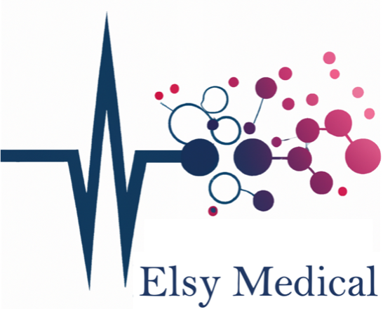

## Elsy Medical  

Elsy envisions a world where every patient will get molecular profiling of suspicious lesions on the spot

#### Our product

Elsy Medical develops E-biopsy – a minimally invasive molecular sampling tool for solid tissue diagnostics

### What is E-biopsy??

## A minimally invasive molecular sampling tool for solid tissues in vivo with electroporation for rapid diagnostics

E-biopsy - is a minimally invasive molecular sampling method that utilizes in-situ electroporation (i.e., pulsed electric fields) to disrupt cell membranes in a targeted area, resulting in the release of cellular components, such as proteins and lipids. Tissue extract is then collected using a syringe, and subsequently, the content is discharged to an external buffer and undergoes molecular analysis consisting of purification, separation, identification, and quantification of the molecular structure of the tissue extract removed. 

The electroporation system consists of a pulsed electric field generator, an applicator, and an analysis unit providing information on the extracted cellular contents.

The feasibility of the E-biopsy was already demonstrated by the project team in animal and in ex vivo human clinical studies. The technology is not limited to a specific tissue, and as such, may support a broad range of clinical applications, such as screening, aiding in diagnosis, detecting of recurrence of tumor post-intervention, assessing tumor heterogeneity, and more. Being an alternative to many other lesion-analysis approaches, it may also augment them leading to improved analysis quality.

Due to its minimally invasive nature, the E-biopsy enables the gathering of multiple samples from the same lesion, opening the possibility of creating its high-resolution spatial molecular profile,  and increasing the sensitivity and specificity of the analysis. Being both simple and molecular-based sampling technology, the E-biopsy approach reduces the load on many clinical resources, and especially on pathologists, thus improving the medical treatment efficiency and reducing the overall costs. 

https://youtu.be/mmqsOUK2Qko

### Challenge

Current tissue diagnostics often  involves tissue biopsy which is time-consuming, costly, has immediate and long term complications such as pain and scars, carries significant environmental impacts, costs time of surgery room, time of a physician, nurse, other personal and is required in the some countries by insurance companies before any surgery.  

### Elsy solution 

We developed a novel approach for minimally invasive, in vivo  tissue sampling with molecular biopsy using electric fields. 

### Team

- <b>Prof. Alexander Golberg</b> is an in medical electroporation technologies. 

- <b>Prof. Avshalom Shalom</b> is a professor for plastic and reconstructive surgery at Tel Aviv University, Tel Aviv Israel, and is the head of the Plastic and reconstructive surgery department in Meir Medical Center. 

- <b>Ms. Julia Wise</b> is an expert molecular biologist 

- <b>Prof. Zohar Yakhini</b> is an expert scientist and research leader in data science and its applications in molecular biology.

- <b>Dr. Edward Vitkin</b> is an expert data scientist 

### Counsel Board

- <a href="https://www.rubinrudman.com/attorneys/peter-b-finn/" target="_blank" > Peter Finn, Rubin and Rudman LLp - General counsel 
  </a>

- <a href="http://www.bmtadvisors.com/" target="_blank" > David Barone- Boston MedTechAvisors. 
</a>

 

### Media and News
- <a href="https://www.eurekalert.org/news-releases/909858" target="_blank" ><b>EurekAlert!</b> [<i>NEWS RELEASE 19-NOV-2019</i>] 
New pulsed electric field technology could lead to less invasive tumor molecular profiling</a>
- <a href="https://english.tau.ac.il/news/biopsy_tumor" target="_blank" ><b>Tel Aviv University </b> [<i>NEWS 26 November 2019</i>] 
New technology could allow less invasive tumor profiling</a>

### Contact Us

<a data-auto-recognition="true" href="mailto:office@elsymedical.com">office@elsymedical.com</a>

